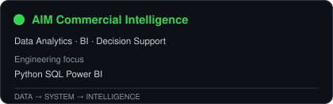
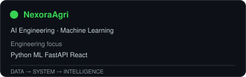
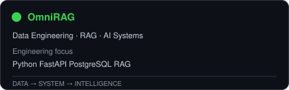
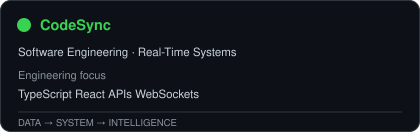
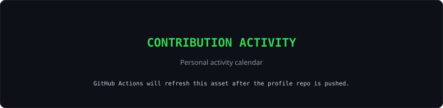
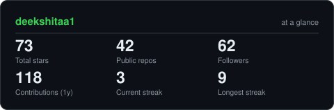
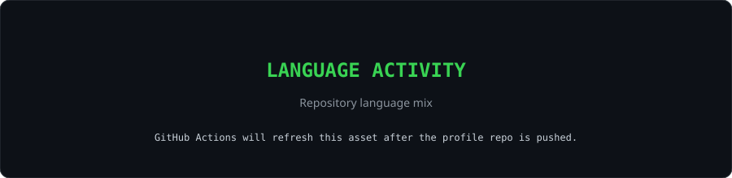
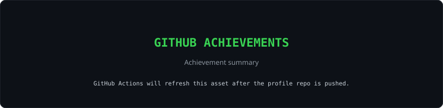

<div align="center">


<br>

<a href="https://github.com/deekshitaa1">
  
</a>
<br>

<a href="https://www.linkedin.com/in/deekshita-rajesh">
  
</a>
<a href="mailto:deekshitarajesh1@gmail.com">
  
</a>
<a href="https://deekshitaa1.github.io/deekshita-portfolio/">
  
</a>
<a href="https://leetcode.com/u/deekshiarajesh/">
  
</a>


</div>

---

## `~/` whoami

```console
$ whoami
Deekshita Rajesh

$ focus --current
Data Analytics  |  Data Engineering  |  AI Engineering  |  Software Engineering

$ objective
Turn data into decisions, intelligent systems, and production-ready software.
```

I build end-to-end systems that connect **data, analytics, machine learning and software engineering**.
My work spans the full path from raw data and business questions to analytical models, APIs, AI workflows and deployable applications.

> **Analyze the data. Engineer the system. Automate the decision.**

---

<div align="center">

## `~/` toolbox


</div>

---

## `~/` capabilities

<table>
<tr>
<td width="33%" valign="top">

### DATA ANALYTICS

`SQL` · `Python` · `Pandas` · `NumPy`  
`EDA` · `Statistics` · `KPI Design`  
`Power BI` · `Data Visualization`  
`Segmentation` · `Business Analysis`

</td>
<td width="33%" valign="top">

### DATA ENGINEERING

`ETL / ELT` · `Data Cleaning`  
`Data Validation` · `Pipelines`  
`PostgreSQL` · `MongoDB`  
`Analytical Datasets` · `APIs`

</td>
<td width="33%" valign="top">

### AI / ML

`Scikit-learn` · `PyTorch` · `TensorFlow`  
`Feature Engineering` · `Model Evaluation`  
`LLMs` · `RAG` · `Embeddings`  
`Agents` · `Decision Intelligence`

</td>
</tr>
<tr>
<td width="33%" valign="top">

### SOFTWARE ENGINEERING

`Python` · `FastAPI` · `REST APIs`  
`React` · `TypeScript` · `Streamlit`  
`SQLAlchemy` · `Git` · `Docker`  
`Backend Architecture`

</td>
<td width="33%" valign="top">

### ENGINEERING PRACTICE

`System Design` · `Testing`  
`Observability` · `CI/CD`  
`Data Quality` · `Reproducibility`  
`Deployment` · `Documentation`

</td>
<td width="33%" valign="top">

### GENERATIVE AI

`RAG` · `Vector Search` · `Prompting`  
`Context Engineering` · `Tool Calling`  
`Agentic Workflows` · `Evaluation`  
`LLM Application Architecture`

</td>
</tr>
</table>

---

<div align="center">

## `~/` skill radar

<table>
<tr>
<td width="50%" align="center" valign="middle">

<picture>
  <source media="(prefers-color-scheme: dark)" srcset="assets/radar-dark.svg">
  <source media="(prefers-color-scheme: light)" srcset="assets/radar-light.svg">
  
</picture>

</td>
<td width="50%" align="center" valign="middle">

<picture>
  <source media="(prefers-color-scheme: dark)" srcset="assets/radar-delivery-dark.svg">
  <source media="(prefers-color-scheme: light)" srcset="assets/radar-delivery-light.svg">
  
</picture>

</td>
</tr>
</table>

</div>

---

## `~/` engineering loop

```text
                         BUSINESS / USER PROBLEM
                                   │
                                   ▼
                            DEFINE THE QUESTION
                                   │
                                   ▼
                              RAW DATA + CONTEXT
                                   │
                     ┌─────────────┴─────────────┐
                     ▼                           ▼
              CLEAN / VALIDATE              ANALYZE / MODEL
                     │                           │
                     └─────────────┬─────────────┘
                                   ▼
                         INSIGHT / INTELLIGENCE
                                   │
                                   ▼
                         API / DASHBOARD / APP
                                   │
                                   ▼
                              DEPLOY + OBSERVE
                                   │
                                   ▼
                              MEASURE + ITERATE
```

The goal is not to build isolated notebooks or isolated AI demos. It is to build **reproducible systems that answer real questions and produce usable outcomes**.

---

<div align="center">

## `~/` selected systems

<table>
<tr>
<td width="50%">
  <a href="https://github.com/deekshitaa1/AIM-Commercial-Intelligence">
    <picture><source media="(prefers-color-scheme: light)" srcset="assets/card-aim-light.svg"></picture>
  </a>
</td>
<td width="50%">
  <a href="https://github.com/deekshitaa1/NexoraAgri">
    <picture><source media="(prefers-color-scheme: light)" srcset="assets/card-nexora-light.svg"></picture>
  </a>
</td>
</tr>
<tr>
<td width="50%">
  <a href="https://github.com/deekshitaa1/OmniRAG">
    <picture><source media="(prefers-color-scheme: light)" srcset="assets/card-omnirag-light.svg"></picture>
  </a>
</td>
<td width="50%">
  <a href="https://github.com/deekshitaa1/CodeSync">
    <picture><source media="(prefers-color-scheme: light)" srcset="assets/card-codesync-light.svg"></picture>
  </a>
</td>
</tr>
</table>

</div>

| System | Role | Engineering focus |
|---|---|---|
| **[AIM Commercial Intelligence](https://github.com/deekshitaa1/AIM-Commercial-Intelligence)** | Data Analytics · BI · Decision Support | Data cleaning → SQL → EDA → KPI design → ML → business prioritization → dashboard |
| **[NexoraAgri](https://github.com/deekshitaa1/NexoraAgri)** | AI Engineering · ML | Data validation → temporal features → classification + regression → explainability → decision engine |
| **[OmniRAG](https://github.com/deekshitaa1/OmniRAG)** | AI Engineering · Data Engineering | Document ingestion → extraction → chunking → PostgreSQL → vector retrieval → RAG |
| **[CodeSync](https://github.com/deekshitaa1/CodeSync)** | Software Engineering | Frontend/backend integration → APIs → real-time collaboration → maintainable application architecture |

---

## `~/` live systems

| Product | Role | Status |
|---|---|---|
| **AIM Commercial Intelligence** | Data Analytics · BI · Predictive Decision Support | **LIVE** |
| **AIM API** | FastAPI · REST Analytics Backend | **LIVE** |
| **AIM Health** | API Health Monitoring | **ONLINE** |

**[OPEN LIVE DASHBOARD](https://aim-commercial-intelligence-dashboard.onrender.com)** · **[OPEN API](https://aim-commercial-intelligence-api-jnrs.onrender.com)** · **[HEALTH CHECK](https://aim-commercial-intelligence-api-jnrs.onrender.com)**

---

## `~/` data → decision

```text
BUSINESS QUESTION
      ↓
RAW DATA
      ↓
CLEAN + VALIDATE
      ↓
SQL / PYTHON
      ↓
EDA + KPI DEVELOPMENT
      ↓
STATISTICAL ANALYSIS
      ↓
MACHINE LEARNING
      ↓
BUSINESS VALUE
      ↓
DASHBOARD / API
      ↓
DECISION + ACTION
```

### Analytics toolkit

| Area | What I work with |
|---|---|
| **Data Analysis** | Data cleaning, EDA, feature engineering, statistics, KPI development |
| **SQL** | Joins, CTEs, aggregations, analytical queries, business metrics |
| **BI** | Power BI, dashboards, segmentation, executive reporting |
| **Machine Learning** | Classification, regression, clustering, anomaly detection, evaluation |
| **Data Engineering** | ETL, preprocessing, data validation, analytical datasets, APIs |
| **GenAI** | LLM applications, RAG, embeddings, vector search, agentic workflows |
| **Software Engineering** | Python, FastAPI, REST APIs, databases, Streamlit, Docker, Git |

---

<div align="center">

## `~/` contribution activity



<br><br>

<picture>
  <source media="(prefers-color-scheme: dark)" srcset="https://raw.githubusercontent.com/deekshitaa1/deekshitaa1/output/snake-dark.svg">
  <source media="(prefers-color-scheme: light)" srcset="https://raw.githubusercontent.com/deekshitaa1/deekshitaa1/output/snake.svg">
  
</picture>

</div>

---

<div align="center">

## `~/` the numbers

<picture>
  <source media="(prefers-color-scheme: dark)" srcset="assets/card-stats-dark.svg">
  <source media="(prefers-color-scheme: light)" srcset="assets/card-stats-light.svg">
  
</picture>

<br>



<br><br>



</div>

---

## `~/` certifications & learning

`Google Data Analytics Professional Certificate` · `Microsoft AI Fundamentals (AI-900)` · `NPTEL Data Science for Engineers`

`DeepLearning.AI Neural Networks and Deep Learning` · `MongoDB Deploying GenAI Apps` · `Infosys Springboard Generative AI` · `ServiceNow Micro-Certification`

---

## `~/` engineering principles

```text
01  START WITH THE BUSINESS QUESTION
02  VALIDATE DATA BEFORE MODELING
03  KEEP ANALYSIS REPRODUCIBLE
04  USE THE SIMPLEST EFFECTIVE MODEL
05  CONNECT METRICS TO BUSINESS VALUE
06  BUILD SYSTEMS THAT CAN BE EXPLAINED
07  DEPLOYMENT IS PART OF ENGINEERING
08  SHIP · MEASURE · ITERATE
```

---

<div align="center">

### DATA · ANALYTICS · ENGINEERING · AI

**Deekshita Rajesh**  
[LinkedIn](https://www.linkedin.com/in/deekshita-rajesh) · [GitHub](https://github.com/deekshitaa1) · [Portfolio](https://deekshitaa1.github.io/deekshita-portfolio/)

<sub>`01000100 01000001 01010100 01000001 00100000 01011100 00100000 01001001 01001110 01010100 01000101 01001100 01001100 01001001 01000111 01000101 01001110 01000011 01000101`</sub>

</div>
